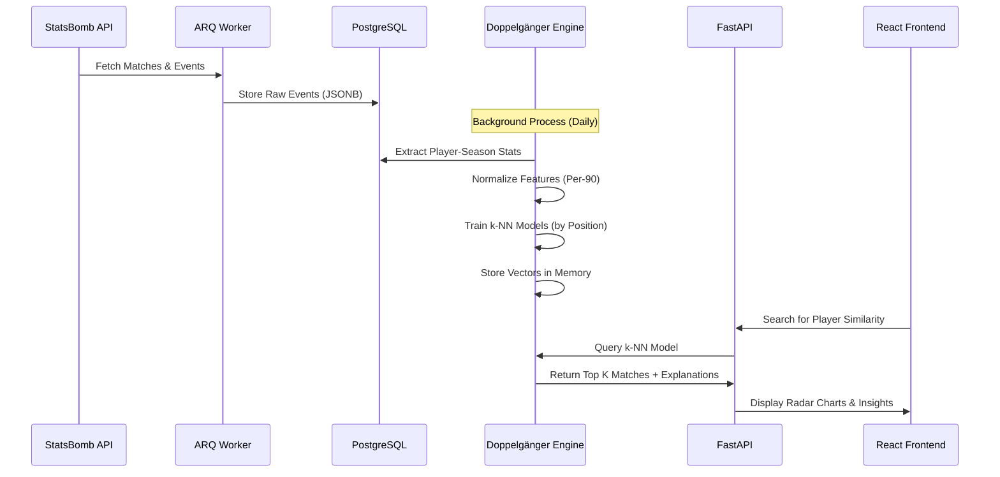
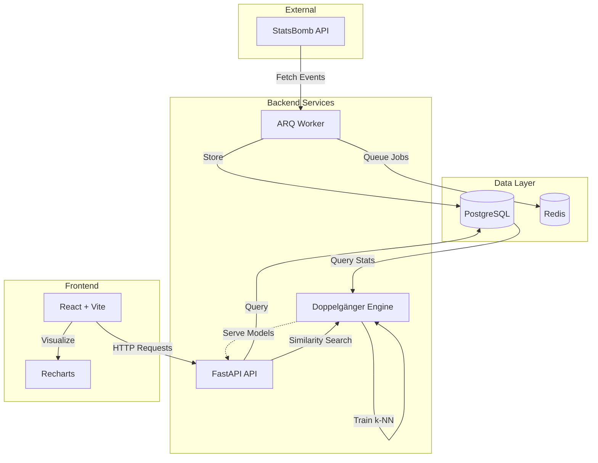
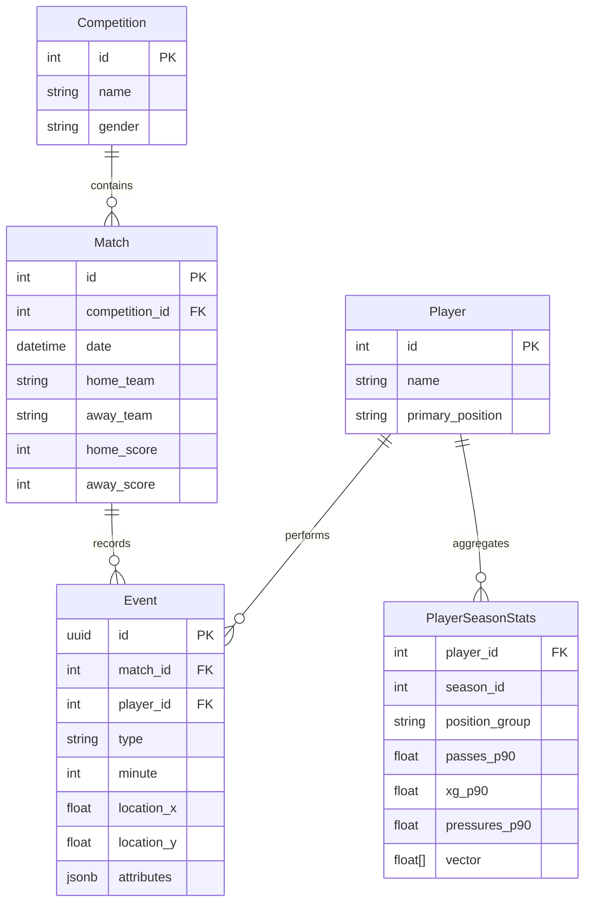

# ⚽ Football Analytics: Doppelgänger Engine

[](https://www.python.org/downloads/)
[](https://fastapi.tiangolo.com/)
[](https://github.com/lazza442233/football-analytics)
[](https://github.com/lazza442233/football-analytics)
[](LICENSE)

> **Moneyball for Football**: A machine learning platform that discovers statistically identical players using vector similarity search on StatsBomb event data.

Find the next Firmino when you can't afford the next Kane. Powered by k-NN algorithms, async Python, and PostgreSQL.

---

## 🎯 What is the Doppelgänger Engine?

The **Doppelgänger Engine** is a player similarity search system that answers the question: *"Which players play **exactly** like [Target Player] in [Season]?"*

**Key Features:**
- 🔍 **Vector-Based Similarity Search**: Represent player performance as high-dimensional vectors and use cosine similarity to find statistical twins
- 🎯 **Context-Aware Comparisons**: Respects position groups (GK, DEF, MID, FWD) and temporal specificity (Kane 2019 ≠ Kane 2024)
- 📊 **Explainable AI**: Every match includes a breakdown of shared strengths and key differences
- ⚡ **Production-Ready Architecture**: Async-first FastAPI backend with React dashboard, ARQ task queue, and PostgreSQL with JSONB storage
- 📈 **Comprehensive Analytics**: Per-90 metrics, xG analysis, progressive passing, defensive actions, and spatial heatmaps

---

## 🚀 Quick Start (5 Minutes)

### Prerequisites

- Docker & Docker Compose
- Python 3.12+
- Poetry (`pip install poetry`)

### 1. Clone & Install

```bash
git clone https://github.com/lazza442233/football-analytics.git
cd football-analytics

# Install dependencies (creates venv and installs src package)
poetry install
```

### 2. Start Infrastructure

```bash
# Start PostgreSQL, Redis, API, and Worker containers
docker compose up -d

# Run database migrations
poetry run alembic upgrade head
```

### 3. Ingest Sample Data

```bash
# Ingest Bundesliga 2023/24 (matches + events)
poetry run python -m src.scripts.ingest_matches \
  --comp-id 9 \
  --season-id 281 \
  --events
```

*This will take 5-10 minutes depending on your connection. See [Data Ingestion Guide](docs/data_ingestion.md) for more competitions.*

### 4. Launch the Application

```bash
# Start API server (http://localhost:8000)
poetry run uvicorn src.main:app --reload

# Start frontend (http://localhost:5173)
cd frontend && npm install && npm run dev
```

**🎉 Done!** Visit `http://localhost:5173` to search for players and explore their statistical doppelgängers.

---

## 🧠 How It Works

The Doppelgänger Engine transforms football match events into player similarity scores through a multi-stage pipeline:



### Core Pipeline Stages

1. **ETL (Extract, Transform, Load)**
   - Ingest match events from StatsBomb Open Data
   - Store structured event data in PostgreSQL with JSONB attributes
   - Handle lineups, substitutions, and player positions

2. **Feature Engineering**
   - Aggregate raw events into per-90 metrics (goals, passes, pressures, xG, etc.)
   - Normalize spatial coordinates and temporal data
   - Apply minimum involvement filter (180+ minutes)

3. **Vectorization**
   - Transform player-season statistics into high-dimensional vectors
   - Use StandardScaler (Z-score normalization)
   - Partition by position group for context-aware comparisons

4. **Similarity Search**
   - Train k-Nearest Neighbors models with cosine similarity
   - Index vectors for fast lookup (<100ms query time)
   - Apply similarity threshold (0.70+ cosine similarity)

5. **Explainability**
   - Identify shared strengths (features where both players excel)
   - Highlight key differences (largest statistical divergence)
   - Generate natural language explanations

---

## 🏗️ Architecture

### System Design



### Tech Stack

| Layer | Technology | Purpose |
|-------|-----------|---------|
| **Backend** | FastAPI | Async REST API with automatic OpenAPI docs |
| **Database** | PostgreSQL 15 + AsyncPG | Event storage with JSONB for flexible schemas |
| **ORM** | SQLModel | Type-safe models with Pydantic validation |
| **Task Queue** | ARQ + Redis | Background ingestion jobs |
| **ML** | scikit-learn | StandardScaler, k-NN, cosine similarity |
| **Frontend** | React 19 + Vite | Modern SPA with hot module reloading |
| **UI Components** | Tailwind CSS + Recharts | Responsive design + radar charts |
| **Migrations** | Alembic | Database version control |
| **Package Manager** | Poetry | Dependency management + virtual environments |
| **Testing** | Pytest + pytest-asyncio | Async test support with 78% coverage |

### Data Model



---

## 📚 Documentation

### Getting Started (Learning-Oriented)
- [Setup & Installation Guide](docs/setup_guide.md) - Step-by-step environment setup
- [Data Ingestion Tutorial](docs/data_ingestion.md) - How to load StatsBomb data
- [Troubleshooting Guide](docs/troubleshooting.md) - Common issues and solutions

### Understanding the System (Explanation-Oriented)
- [Doppelgänger Architecture](docs/dev/arch_doppelganger.md) - How the similarity engine works
- [Frontend Dashboard Design](docs/dev/arch_frontend_dashboard.md) - UI/UX architecture
- [Project Structure](docs/project_structure.md) - Codebase organization

### Reference (Information-Oriented)
- [API Documentation](http://localhost:8000/docs) - Interactive OpenAPI spec (when running)
- [Database Schema](docs/data_ingestion.md) - Table definitions and relationships
- [Configuration Reference](docs/setup_guide.md#environment-variables-reference) - Environment variables

---

## 🧪 Development

### Running Tests

```bash
# Run full test suite
poetry run pytest

# Run with coverage report
poetry run pytest --cov=src --cov-report=term-missing

# Run specific test file
poetry run pytest tests/analytics/test_doppelganger.py

# Run with verbose output
poetry run pytest -v
```

### Code Quality

```bash
# Run linter (errors + pyflakes + import sorting)
poetry run ruff check .

# Auto-fix issues
poetry run ruff check --fix .

# Type checking
poetry run mypy src/
```

### Pre-commit Hooks

```bash
# Install hooks (runs ruff on every commit)
poetry run pre-commit install

# Run manually on all files
poetry run pre-commit run --all-files
```

---

## 🗂️ Project Structure

```
football-analytics/
├── src/
│   ├── api/                      # FastAPI application
│   │   └── routers/              # API endpoints
│   ├── analytics/                # ML & Analytics
│   │   └── doppelganger/         # Similarity engine
│   │       ├── etl.py            # Data extraction
│   │       ├── preprocess.py     # Feature engineering
│   │       ├── train.py          # Model training
│   │       ├── model.py          # Inference
│   │       └── explain.py        # Explainability
│   ├── scripts/                  # CLI tools
│   │   └── ingest_matches.py     # Data ingestion
│   ├── services/                 # Business logic
│   │   ├── ingestion.py          # ETL service
│   │   └── analytics.py          # Analytics service
│   ├── models.py                 # Database schema (SQLModel)
│   ├── database.py               # Session management
│   ├── config.py                 # Environment config
│   └── main.py                   # API entrypoint
│
├── frontend/                     # React application
│   ├── src/
│   │   ├── components/           # UI components
│   │   ├── pages/                # Route pages
│   │   └── api/                  # API client
│   └── package.json
│
├── tests/                        # Pytest suite
│   ├── analytics/                # Doppelgänger tests
│   ├── api/                      # API endpoint tests
│   └── conftest.py               # Shared fixtures
│
├── migrations/                   # Alembic migrations
├── docs/                         # Documentation
├── docker-compose.yml            # Infrastructure setup
├── pyproject.toml                # Poetry configuration
└── alembic.ini                   # Migration config
```

---

## 🌟 Key Features Explained

### 1. Async-First Architecture

Every database call and HTTP request is async, ensuring high throughput and low latency:

```python
async with AsyncSession(engine) as session:
    result = await session.execute(select(Player).where(Player.id == player_id))
    player = result.scalar_one_or_none()
```

### 2. Background Task Queue (ARQ)

Heavy ingestion jobs are offloaded to a Redis-backed worker:

```python
# Enqueue a background job
job = await arq_redis.enqueue_job("ingest_competition", comp_id=9, season_id=281)

# Worker processes asynchronously
async def ingest_competition(ctx, comp_id: int, season_id: int):
    service = StatsBombIngestionService(ctx["session"])
    await service.ingest_season(comp_id, season_id)
```

### 3. JSONB Storage for Flexibility

Complex event attributes are stored in PostgreSQL's native JSONB type:

```python
Event(
    type="Pass",
    location_x=60.5,
    location_y=40.2,
    attributes={  # Stored as JSONB
        "pass": {
            "end_location": [80.0, 45.0],
            "recipient": {"id": 5503, "name": "Lionel Messi"},
            "type": {"name": "Through Ball"}
        },
        "under_pressure": True
    }
)
```

### 4. Golden Master Testing

Protect against regressions by comparing outputs to known-good snapshots:

```python
def test_ingestion_golden_master(async_session, golden_data):
    """Ensure ingestion output matches snapshot from Jan 2026."""
    result = await service.ingest_match(match_id=3788741)
    assert result["events_count"] == golden_data["events_count"]
    assert result["players_count"] == golden_data["players_count"]
```

---

## 🔧 Common Use Cases

### Finding Budget Alternatives

**Scenario**: Your club wants a Harry Kane-style striker but only has £15M.

```bash
# Query the Doppelgänger API
GET /analytics/doppelganger?player_id=1668&season_id=4&limit=10

# Results include:
# - Roberto Firmino (98% similar)
# - Explanation: "Both excel at deep drops and pressing, but Firmino has +1.2 SD more tackles"
```

### Scouting Emerging Talent

**Scenario**: Find young players with similar profiles to peak-era Kevin De Bruyne.

```bash
# Filter by age and league
GET /analytics/doppelganger?player_id=5503&season_id=27&min_age=18&max_age=23
```

### Squad Building Analysis

**Scenario**: Ensure tactical diversity by identifying overlapping player profiles.

```python
# Check squad redundancy
squad = [player1_id, player2_id, player3_id]
for player in squad:
    matches = doppelganger_engine.find_similar(player, limit=5)
    if any(m["player_id"] in squad for m in matches):
        print(f"⚠️  Squad overlap detected: {player} similar to {m['name']}")
```

---

## 🤝 Contributing

We follow the [Conventional Commits](https://www.conventionalcommits.org/) specification:

```bash
feat: add xT (expected threat) metric to player vectors
fix: correct position mapping for wing-backs
docs: update API reference for similarity endpoint
test: add integration test for match ingestion
```

### Development Process

1. Fork the repository
2. Create a feature branch (`git checkout -b feat/amazing-feature`)
3. Make your changes and add tests
4. Run the test suite (`poetry run pytest`)
5. Commit using conventional commits (`git commit -m "feat: add amazing feature"`)
6. Push to your fork (`git push origin feat/amazing-feature`)
7. Open a Pull Request

---

## 📊 Project Status

- ✅ **Core Engine**: Doppelgänger similarity search (v1.0)
- ✅ **Data Ingestion**: StatsBomb Open Data pipeline
- ✅ **API**: RESTful endpoints with OpenAPI docs
- ✅ **Frontend**: React dashboard with player search
- 🚧 **Enhanced Metrics**: xT (Expected Threat) integration
- 🚧 **Position-Specific Features**: Goalkeeper-specific metrics
- 📋 **Planned**: Real-time match event ingestion
- 📋 **Planned**: User authentication and saved searches

---

## 📝 License

This project is licensed under the MIT License - see the [LICENSE](LICENSE) file for details.

---

## 🙏 Acknowledgments

- **StatsBomb** for providing free, high-quality football event data
- **FastAPI** team for an incredible async web framework
- **scikit-learn** for robust ML primitives
- The football analytics community for inspiring this work

---

## 📞 Support

- 📖 **Documentation**: [docs/](docs/)
- 🐛 **Bug Reports**: [GitHub Issues](https://github.com/lazza442233/football-analytics/issues)
- 💬 **Discussions**: [GitHub Discussions](https://github.com/lazza442233/football-analytics/discussions)

---

<p align="center">
  <i>Built with ❤️ for the football analytics community</i>
</p>
