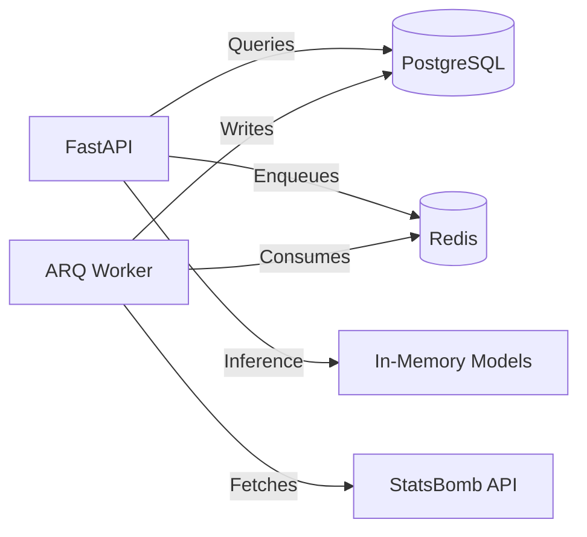

# Project Audit & Future Direction Report

**Date:** February 14, 2026
**Version:** 1.1.0
**Lead Engineer:** GitHub Copilot

---

## 1. Executive Summary

Since the last audit on February 2nd, the **Football Analytics** platform has shipped two major architectural milestones: the **Doppelgänger Engine (Beta)** and a robust **Background Worker** system using ARQ.

The application has evolved from a data ingestion tool into an analytical engine capable of high-level inference (player similarity search). The introduction of asynchronous background workers has significantly improved API responsiveness by offloading heavy ingestion tasks.

## 2. Technical Architecture Status

### New Core Components

- **Doppelgänger Engine:** A vector-based similarity search engine hosted in-memory using `scikit-learn`. It features a modular pipeline: `ETL` -> `Feature Engineering` -> `Vectorization` -> `Explanation`.
- **Background Workers:** `src/worker.py` orchestrates heavy lifting (ingestion) via Redis/ARQ, decoupling processing time from HTTP response time.
- **Observability:** Structured JSON logging (`src/logging_conf.py`) is now standard across all services.

### Architecture Diagram Update

---

## 3. Quality Assurance Audit

### Test Coverage Update

| Module                                 | Status    | Notes                                                |
| :------------------------------------- | :-------: | :--------------------------------------------------- |
| **Doppelgänger Engine**                | 🟢 Strong | `tests/test_doppelganger.py` covers ETL & Logic well.|
| **Background Workers**                 | 🟢 Strong | `tests/test_api_ingest.py` verifies queuing logic.   |
| **Services - Ingestion**               | 🟡 Good   | improved, but heavily dependent on Golden Master.    |
| **Services - Analytics**               | 🟢 Strong | Robust fixture-based testing.                        |

**Strengths:**
- **Explainability Logic:** The `explain_match` function in the Doppelgänger engine is well-abstracted and provides human-readable context for algorithmic results.
- **Strict Configuration:** The usage of `pydantic-settings` in `src/config.py` ensures environment safety.

**Weaknesses:**
- **Test Data Management:** Integration tests rely on complex manual fixture creation (e.g., creating 4 matches with specific events in `tests/test_doppelganger.py`). This may become unmaintainable as schema complexity grows.

---

## 4. Current Blockers & Technical Debt

1.  **In-Memory Model Scaling:** The Doppelgänger models (`NearestNeighbors`) are currently trained on startup or demand and stored in memory (`src/analytics/doppelganger/registry.py`). As the dataset grows to thousands of player-seasons, this will increase the memory footprint of the API containers and increase startup time.
2.  **ETL Rigidity:** The feature engineering logic in `src/analytics/doppelganger/etl.py` effectively hardcodes certain statistical definitions using pandas. Changes to StatsBomb's event definitions could silently skew "DNA" vectors without breaking code execution.
3.  **Frontend Gap:** We have a powerful API, but no visual way to demonstrate the "Similar Players" feature to non-technical stakeholders.

---

## 5. Future Direction & Roadmap

### Phase 2: Feature Expansion (Ongoing)

- [x] **Background Tasks**: Completed via ARQ.
- [x] **Doppelgänger Engine (Beta)**: Core logic, API, and Explainability shipped.
- [ ] **"The Oracle" (Beta)**: Next priority. Integrate a Natural Language Interface (LLM) to convert English questions ("Who had the highest xG in the Euro 2024 final?") into SQL/Analytics Service calls.

### Phase 3: Operational Maturity (Weeks 5-8)

- [ ] **Model Persistence**: Move from training models on startup to saving/loading trained artifacts (e.g., `joblib` or `pickle`) to S3 or disk. This decouples API startup from model training.
- [ ] **Frontend Dashboard**: Build a Streamlit or React dashboard to visualize Player DNA comparisons (Radar Charts) and similarity results.
- [ ] **Caching Layer**: Implement aggressive caching (Redis) for Doppelgänger results, as historical player-season similarities rarely change.

## 6. Conclusion

The platform is now "Feature Complete" for its Beta analytics goals. The implementation of the Doppelgänger engine demonstrates that the architecture can support advanced data science workflows alongside standard CRUD operations. The immediate focus should shift towards **"The Oracle"** (LLM integration) and **Visualization**, transforming raw data into accessible insights.
